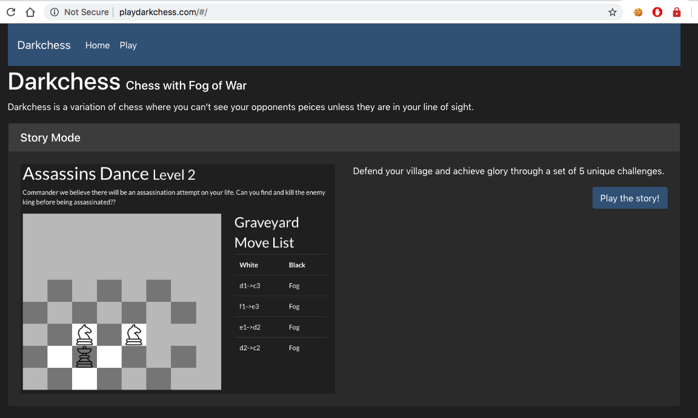

# Darkchess

Chess with Fog of War. 

## Building

Terminal one
> make

Terminal two
> make ui

## Deploy

Check out the appspec and buildspec files. I use AWS CodePipeline. Once it's setup, you just:

git push codecommit master 

## Tech Stack

### UI
* React/Typescript on the front, built using `npx create-react-app`.
* react-router-v4, standard bootstrap
* uses create-react-app build scripts for minimized deploy bundles

### Java backend
* maven for dep management and building
* rest api using jersey
* tests in junit
* morhpia for mongo stuff
* mongodb atlas <3 for datastore
* logging logback/slf4j

### aws deploy
* maven shade plugin to build fat jar
* aws codecommit to start ci/cd
* aws codebuild to create artifacts -> s3
* aws codedeploy /w codedeploy agent on ec2 for deploys, see ./scripts for agent scripts
* ALB for routing traffic to ec2, using ACM for certificate and route53 for dns record

### config
* aws cloudlog agent for dumping logs to aws cloudwatch 
* init.d/ service script with nohup